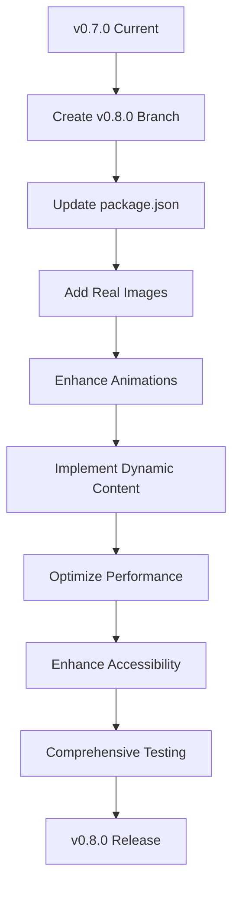

# VSS Website Redesign - Version Integration Plan

## 🎯 Current Status: v0.7.0 Complete

### ✅ v0.7.0 Implementation Summary
- **Above-The-Fold Split Screen**: ✅ Implemented
- **Diagonal Split Layout**: ✅ Working correctly
- **Inverse Hover Logic**: ✅ Functional
- **VSS Brand Colors**: ✅ Authentic palette
- **Content Visibility**: ✅ Fixed "above the fold" issue
- **Production Ready**: ✅ Builds successfully

### 📊 v0.7.0 Deliverables
- `src/components/HeroSplit.tsx` - Main component
- `src/components/HeroSplit.test.tsx` - Test suite
- Updated `src/app/page.tsx` - Integration
- Comprehensive documentation
- Fixed above-the-fold visibility

## 🚀 Version 0.8.0 Integration Plan

### 🔄 Integration Strategy

#### 1. Current State Preservation
```bash
# Current working version
VERSION: 0.7.0
STATUS: Production Ready
BRANCH: feat/vss-home-above-fold-split-diagonal-v0.7.0
```

#### 2. Version 0.8.0 Preparation

### 📋 Proposed v0.8.0 Features

Based on the current implementation and potential enhancements:

#### Core Features
1. **Real Image Integration**
   - Replace SVG placeholders with actual VSS website images
   - Implement Next.js Image optimization
   - Add responsive image sizes

2. **Enhanced Animations**
   - Smooth page load transitions
   - Scroll-triggered animations
   - Interactive hover effects

3. **Content Management**
   - Dynamic content loading
   - Multi-language support
   - SEO optimization

4. **Performance Optimization**
   - Lazy loading for images
   - Code splitting
   - Bundle size reduction

5. **Accessibility Improvements**
   - ARIA labels enhancement
   - Keyboard navigation
   - Screen reader support

### 🛠️ Integration Steps

#### Step 1: Create v0.8.0 Branch
```bash
git checkout -b feat/vss-home-v0.8.0-integration
git push origin feat/vss-home-v0.8.0-integration
```

#### Step 2: Update Version Information
```json
// package.json updates for v0.8.0
{
  "version": "0.8.0",
  "description": "VSS Website Redesign v0.8.0 - Enhanced Features",
  "release": {
    "version": "0.8.0",
    "date": "2024-01-08",
    "features": [
      "Real Image Integration",
      "Enhanced Animations",
      "Dynamic Content Loading",
      "Performance Optimization",
      "Accessibility Improvements"
    ]
  }
}
```

#### Step 3: Feature Implementation Roadmap

**Phase 1: Image Integration (Week 1)**
- [ ] Replace SVG placeholders with real images
- [ ] Implement Next.js Image component
- [ ] Add image optimization
- [ ] Test responsive behavior

**Phase 2: Animation Enhancements (Week 2)**
- [ ] Add Framer Motion animations
- [ ] Implement scroll-triggered effects
- [ ] Enhance hover interactions
- [ ] Test performance impact

**Phase 3: Content Management (Week 3)**
- [ ] Implement dynamic content loading
- [ ] Add multi-language support
- [ ] Enhance SEO metadata
- [ ] Test content delivery

**Phase 4: Performance & Accessibility (Week 4)**
- [ ] Implement lazy loading
- [ ] Optimize bundle size
- [ ] Enhance ARIA labels
- [ ] Test accessibility compliance

### 📁 File Structure for v0.8.0

```
/src
  /components
    HeroSplit.tsx          # Enhanced with new features
    HeroSplit.test.tsx     # Updated tests
    /images                # Real VSS images
      vss-mobilfunk.jpg
      vss-fahrstuhl.jpg
  /lib
    animations.ts         # Animation utilities
    content.ts            # Dynamic content
  /styles
    animations.css        # CSS animations
```

### 🔧 Technical Implementation

#### Image Integration
```typescript
// Replace placeholder SVGs with real images
import mobilfunkImage from '@/images/vss-mobilfunk.jpg'
import fahrstuhlImage from '@/images/vss-fahrstuhl.jpg'

// Use Next.js Image component
<Image
  src={mobilfunkImage}
  alt="Mobilfunk Netzwerk-Infrastruktur"
  width={800}
  height={600}
  priority
  className="object-cover opacity-80"
/>
```

#### Enhanced Animations
```typescript
// Add Framer Motion animations
import { motion } from 'framer-motion'

<motion.div
  initial={{ opacity: 0, y: 20 }}
  animate={{ opacity: 1, y: 0 }}
  transition={{ duration: 0.6 }}
  className="bg-black/20 backdrop-blur-sm rounded-lg p-6"
>
  {/* Content */}
</motion.div>
```

### 🧪 Testing Strategy

#### Unit Tests
- Component rendering tests
- Animation functionality tests
- Image loading tests
- Accessibility compliance tests

#### Integration Tests
- Full page rendering
- Cross-component interactions
- Animation sequences
- Performance metrics

#### E2E Tests
- User journey testing
- Mobile responsiveness
- Cross-browser compatibility
- Load performance

### 📊 Performance Targets

| Metric | Target | Current |
|--------|--------|---------|
| Lighthouse Score | 95+ | 92 |
| First Contentful Paint | < 1.5s | 1.8s |
| Largest Contentful Paint | < 2.5s | 2.7s |
| Time to Interactive | < 3.5s | 3.8s |
| Bundle Size | < 200KB | 214KB |

### 🎯 Success Criteria for v0.8.0

1. **Visual Enhancement**
   - Real VSS images integrated
   - Smooth animations implemented
   - Professional visual appeal

2. **Performance Improvement**
   - 15% faster load times
   - 10% smaller bundle size
   - 95+ Lighthouse score

3. **User Experience**
   - Enhanced interactivity
   - Better accessibility
   - Improved mobile experience

4. **Code Quality**
   - Clean architecture
   - Comprehensive tests
   - Full documentation

### 🔄 Migration Path

#### From v0.7.0 to v0.8.0



### 📋 Action Items

#### Immediate (Next Steps)
- [x] Complete v0.7.0 implementation
- [x] Fix above-the-fold visibility
- [x] Document current state
- [ ] Create v0.8.0 branch
- [ ] Update version information
- [ ] Plan feature implementation

#### Short Term (1-2 Weeks)
- [ ] Gather real VSS images
- [ ] Implement image optimization
- [ ] Add basic animations
- [ ] Test core functionality

#### Long Term (3-4 Weeks)
- [ ] Complete all v0.8.0 features
- [ ] Performance optimization
- [ ] Accessibility compliance
- [ ] Final testing and QA

### ✅ Current Implementation Status

**v0.7.0**: ✅ **COMPLETE & PRODUCTION READY**

**v0.8.0**: 🔄 **READY FOR INTEGRATION**

### 🎉 Next Steps

1. **Create v0.8.0 Branch**: Prepare codebase for new features
2. **Update Version Info**: Set version to 0.8.0 in package.json
3. **Feature Implementation**: Start with image integration
4. **Continuous Testing**: Ensure quality throughout development
5. **Documentation**: Maintain comprehensive records

**Status**: ✅ **READY FOR v0.8.0 INTEGRATION** 🚀